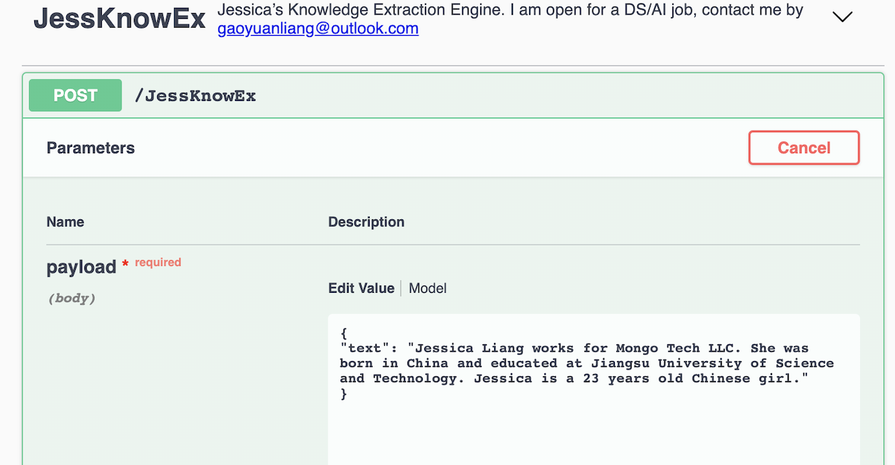
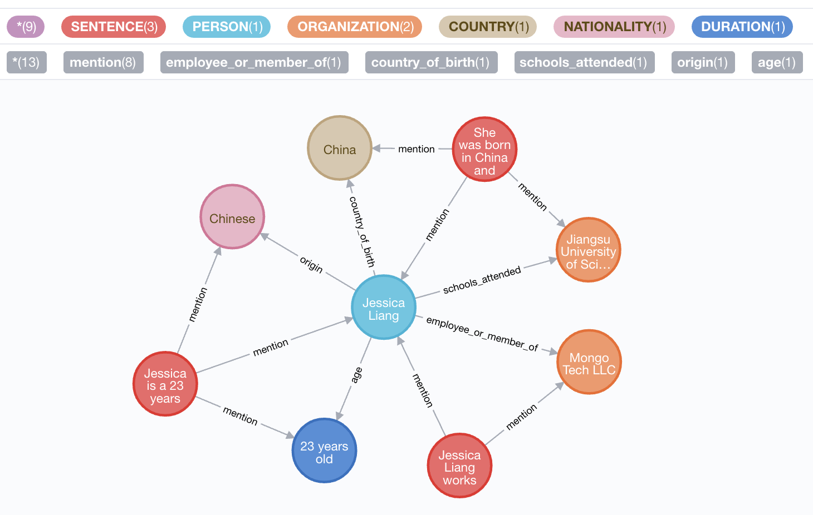

# Jessica's Knowledge Extraction Engine

## start the service

```bash
docker pull gaoyuanliang/jessica_knowledge_extraction:1.0.1

docker run -it \
-p 4567:4567 \
-p 8765:8765 \
-p 7563:9000 \
gaoyuanliang/jessica_knowledge_extraction:1.0.1
```

## input the text
input rest api: http://0.0.0.0:7563/

input example:

```python
{
"text": "Jessica Liang works for Mongo Tech LLC. She was born in China and educated at Jiangsu University of Science and Technology. Jessica is a 23 years old Chinese girl."
}
```




## see the output

outout neo4j:http://0.0.0.0:4567/browser/

password: neo4j1


